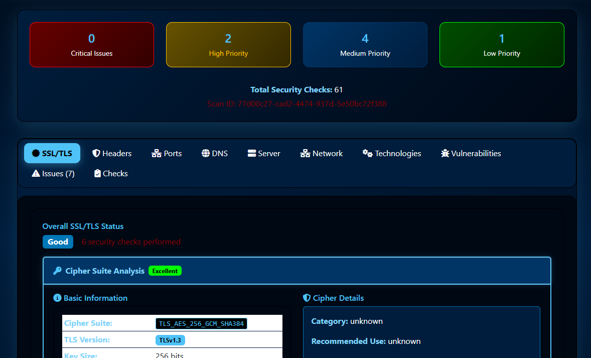
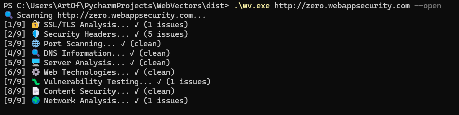

# WebVectors 🔒

A comprehensive Python-based website security scanner with both CLI and web interface options. This tool performs robust security analysis including SSL/TLS testing, vulnerability assessment, compliance checking, and provides professional security reporting with scoring systems.

    

## 📸 Screenshot



*Comprehensive security analysis with detailed SSL/TLS inspection, vulnerability testing, and compliance checking*



## �🚀 Enhanced Features (v2.0)

### Core Security Analysis
- **Comprehensive SSL/TLS Analysis**: Certificate validation, cipher analysis, protocol security
- **Advanced Security Headers Testing**: Quality scoring with detailed recommendations
- **Vulnerability Assessment**: SQL injection, XSS, directory traversal, authentication bypass
- **Sensitive File Discovery**: Automated detection of exposed configuration files
- **Network Security Analysis**: DNS security, CDN detection, infrastructure assessment
- **Content Security Analysis**: Detection of sensitive information exposure

### 🆕 Enhanced SSL/TLS Security Analysis (v2.0)
- **Modern Cryptography Standards**: TLS 1.3 support, ECC algorithms, quantum-resistant assessment
- **Certificate Chain Analysis**: Complete validation including SAN, key strength, hash algorithms
- **Compliance Verification**: NIST, PCI DSS, modern browser compatibility checks
- **Vulnerability Detection**: POODLE, BEAST, Heartbleed vulnerability assessment
- **Cipher Suite Analysis**: Forward secrecy, AEAD encryption, security level grading
- **Protocol Support Testing**: Deprecated protocol detection with risk assessment
- **Modern Crypto Scoring**: 0-100% scoring system for cryptographic compliance
- **Future-Ready Assessment**: TLS 1.3 readiness and quantum resistance evaluation

### Professional Reporting
- **Security Scoring System**: 0-100% scores with letter grades (A+ to F)
- **Risk Assessment**: Categorized risk levels with priority action recommendations
- **Compliance Checking**: OWASP Top 10, PCI DSS, NIST, ISO 27001 standards
- **Visual Dashboard**: Enhanced UI with charts, progress indicators, and color-coded results
- **Detailed Reporting**: Comprehensive analysis with remediation guidance

### Technical Enhancements
- **Concurrent Scanning**: 8 parallel security checks for faster analysis
- **Persistent Storage**: SQLite database for scan history and results
- **Enhanced Metadata**: Detailed scan tracking and performance metrics
- **Robust Error Handling**: Graceful failure handling with detailed error reporting
- **Professional Templates**: Modern responsive design with print functionality

## Features

### 🔒 Enhanced SSL/TLS Analysis
#### Certificate Security
- **Certificate Validation**: Subject, issuer, SAN verification with domain matching
- **Expiration Monitoring**: Multi-tier warnings (expired, critical, soon-to-expire)
- **Key Strength Analysis**: RSA/ECC algorithm detection with size validation
- **Hash Algorithm Security**: SHA-1 deprecation warnings, modern algorithm verification
- **Certificate Lifetime**: Compliance with modern 825-day limits
- **Self-Signed Detection**: CA verification and trust chain analysis

#### Cryptographic Assessment
- **Protocol Analysis**: TLS 1.0/1.1 deprecation, TLS 1.2/1.3 modern support
- **Cipher Suite Evaluation**: Forward secrecy, AEAD encryption, security grading
- **Vulnerability Scanning**: POODLE, BEAST, Heartbleed attack surface analysis
- **Modern Standards**: NIST guidelines, PCI DSS compliance verification

#### Future-Ready Features
- **TLS 1.3 Support**: Next-generation protocol readiness assessment
- **Quantum Resistance**: ECC algorithm evaluation for post-quantum security
- **Compliance Scoring**: 0-100% modern cryptography adoption rating
- **Security Features**: Advanced encryption detection (GCM, ChaCha20-Poly1305)

### 🛡️ Security Headers Assessment
- Content Security Policy (CSP)
- HTTP Strict Transport Security (HSTS)
- X-Frame-Options
- X-Content-Type-Options
- Referrer-Policy
- Permissions-Policy
- X-XSS-Protection

### 🌐 Socket-Based Port Scanning
- Common port discovery (80, 443, 21, 22, 25, 53, 110, 143, 993, 995)
- Service identification with timeout handling
- Security risk assessment for open ports
- Fast, reliable socket-based connections

### 🔍 DNS Information Gathering
- DNS record enumeration (A, MX, TXT)
- SPF record checking
- DMARC policy verification
- DKIM configuration detection

### 🐛 Vulnerability Testing
- Basic SQL injection testing
- Cross-Site Scripting (XSS) detection
- Directory traversal testing
- Sensitive file exposure checking

### 📊 Server Information
- Server software identification
- Technology stack detection
- Information disclosure assessment

## Installation

### Prerequisites
- Python 3.7 or higher
- pip (Python package installer)

### On Windows
1. Install Python from [python.org](https://python.org)

### Setup Instructions

1. **Clone or download the project:**
   ```bash
   git clone https://github.com/artofscripting/Web-Vectors.git
   # or download and extract the ZIP file
   ```

2. **Navigate to the project directory:**
   ```bash
   cd Web-Vectors
   ```

3. **Create a virtual environment (recommended):**
   ```bash
   # On Windows
   python -m venv venv
   
   # On Linux/macOS (handles externally-managed-environment)
   python3 -m venv venv --system-site-packages
   ```

4. **Activate the virtual environment:**
   - On Windows:
     ```bash
     venv\Scripts\activate
     ```
   - On macOS/Linux:
     ```bash
     source venv/bin/activate
     ```

5. **Install required dependencies:**
   ```bash
   pip install -r requirements.txt
   ```
   
   **If you get "externally-managed-environment" error:**
   ```bash
   # Debian/Ubuntu Linux
   chmod +x fix_python_env.sh
   ./fix_python_env.sh
   
   # Amazon Linux
   chmod +x fix_python_env_amazon.sh
   ./fix_python_env_amazon.sh
   ```

6. **Run the CLI application:**
   ```bash
   python wv.py <target_url>
   ```
   
   **Or run the web interface:**
   ```bash
   python app.py
   ```

### Building Standalone Executable

To create a standalone executable that doesn't require Python installation:

1. **Install PyInstaller:**
   ```bash
   pip install pyinstaller
   ```

2. **Build the executable:**
   ```bash
   pyinstaller webvectors.spec
   ```

3. **Find the executable:**
   ```
   dist/WebVectors.exe  (Windows)
   ```

4. **Use the launcher script (Windows):**
   ```bash
   webvectors.bat https://example.com
   ```

The executable includes:
- All Python dependencies bundled
- HTML report templates embedded
- Custom WebVectors icon
- No Python installation required

### Production Deployment

For production deployment on servers:

**Debian/Ubuntu:**
```bash
chmod +x install_debian_service.sh
./install_debian_service.sh --domain your-domain.com
```

**Amazon Linux:**
```bash
chmod +x install_amazon_linux.sh
./install_amazon_linux.sh --domain your-domain.com

# If you get "amazon-linux-extras: command not found"
chmod +x install_amazon_linux_robust.sh
./install_amazon_linux_robust.sh --domain your-domain.com
```

7. **Open your web browser and navigate to:**
   ```
   http://localhost:5000
   ```

## Usage

### CLI Usage
1. Run the command-line scanner:
   ```bash
   python wv.py <target_url>
   ```
2. View the generated HTML report in your browser
3. Reports are saved in the current directory

### Web Interface Usage
1. Start the Flask web application:
   ```bash
   python app.py
   ```
2. Open your web browser and navigate to: `http://localhost:5000`
3. Enter the target website URL in the input field
4. Click "Start Scan" to begin the security assessment
5. Monitor the progress bar as the scan proceeds
6. View detailed results once the scan completes

### Understanding Results

#### Security Score
- **A (90-100):** Excellent security posture
- **B (80-89):** Good security with minor improvements needed
- **C (70-79):** Average security with several improvements needed
- **D (60-69):** Poor security with significant issues
- **F (0-59):** Critical security issues requiring immediate attention

#### Result Categories
- **SSL/TLS:** Certificate and encryption analysis
- **Security Headers:** HTTP security header assessment
- **Port Scan:** Open port and service discovery
- **DNS Info:** Domain configuration and security features
- **Vulnerabilities:** Basic vulnerability testing results
- **Server Info:** Technology and server information

## Configuration

### Environment Variables
You can configure the application using environment variables:

- `FLASK_ENV`: Set to `development` for debug mode
- `FLASK_PORT`: Change the default port (default: 5000)
- `SECRET_KEY`: Change the Flask secret key for production

### Port Scanning Configuration
The default port scan covers common ports. To modify the port list, edit the `common_ports` list in `security_scanner.py`.

## API Endpoints

### REST API
- `POST /scan` - Start a new security scan
- `GET /scan/<scan_id>/status` - Get scan progress
- `GET /scan/<scan_id>/results` - Get scan results
- `GET /api/health` - Health check endpoint

### Example API Usage
```bash
# Start a scan
curl -X POST http://localhost:5000/scan \
  -H "Content-Type: application/json" \
  -d '{"url": "https://example.com"}'

# Check scan status
curl http://localhost:5000/scan/<scan_id>/status

# Get results
curl http://localhost:5000/scan/<scan_id>/results
```

## Security Considerations

### Important Notice
⚠️ **This tool is for educational and authorized testing purposes only.**

- Only test websites you own or have explicit permission to test
- Unauthorized testing may violate laws and terms of service
- Results should be verified by security professionals
- This tool does not guarantee complete security assessment

### Limitations
- Basic vulnerability testing (not comprehensive penetration testing)
- Limited to common ports in port scanning
- Some features require network connectivity and proper DNS resolution
- Results are for informational purposes only

## Development

### Project Structure
```
WebVectors/
├── wv.py                  # Command-line interface
├── app.py                 # Flask web application
├── security_scanner.py    # Core security scanning logic
├── requirements.txt       # Python dependencies
├── README.md             # This file
├── templates/            # HTML templates
│   ├── base.html
│   ├── index.html
│   ├── results.html
│   ├── cli_report.html   # CLI report template
│   ├── about.html
│   └── error.html
└── static/              # Static files
    ├── css/
    │   └── style.css
    └── js/
        └── app.js
```

### Adding New Security Checks
1. Add new methods to the `SecurityScanner` class in `security_scanner.py`
2. Update the `scan_all()` method to include your new check
3. Modify the results template to display new scan results
4. Update the scoring algorithm in `calculate_security_score()`

### Contributing
1. Fork the repository
2. Create a feature branch
3. Make your changes
4. Test thoroughly
5. Submit a pull request

## Troubleshooting

### Common Issues

1. **ModuleNotFoundError: No module named 'nmap'**
   - Install python-nmap: `pip install python-nmap`
   - Ensure nmap is installed on your system

2. **Permission denied errors during port scanning**
   - Run with administrator/sudo privileges for advanced port scanning
   - Some scans may be limited by firewall settings

3. **DNS resolution errors**
   - Check your internet connection
   - Verify the target domain is accessible
   - Some DNS queries may be blocked by network policies

4. **SSL/TLS errors**
   - Target site may have SSL/TLS configuration issues
   - Some sites may block automated SSL checks

### Performance Tips
- Scans may take 30-60 seconds depending on the target
- Larger port ranges will increase scan time
- Network latency affects overall performance

## License

This project is provided for educational purposes. Please ensure you have permission before testing any websites.

## Troubleshooting

### Common Installation Issues

**1. "externally-managed-environment" Error (Linux/macOS)**
```bash
# Quick fix - run the environment setup script
chmod +x fix_python_env.sh
./fix_python_env.sh

# Amazon Linux fix
./fix_python_env_amazon.sh

# OR manually create virtual environment
python3 -m venv venv --system-site-packages
source venv/bin/activate
pip install -r requirements.txt
```

**2. "No module named 'venv'" (Linux)**
```bash
# Debian/Ubuntu
sudo apt update
sudo apt install python3-venv

# Amazon Linux 2
sudo yum install python3-devel

# Amazon Linux 2023
sudo dnf install python3-devel
```

**3. Package Installation Issues (Amazon Linux)**
```bash
# Install development tools
sudo yum groupinstall -y "Development Tools"  # AL2
sudo dnf groupinstall -y "Development Tools"  # AL2023

# Install missing dependencies
sudo yum install -y openssl-devel libffi-devel  # AL2
sudo dnf install -y openssl-devel libffi-devel  # AL2023
```

**4. Permission Denied (Linux)**
```bash
# Make scripts executable
chmod +x *.sh

# If running as service, check user permissions
sudo chown -R webscan:webscan /home/webscan/WebSiteInfo
```

**5. Firewall Issues (Amazon Linux)**
```bash
# Check firewalld status
sudo firewall-cmd --state

# Allow application port
sudo firewall-cmd --permanent --add-port=8000/tcp
sudo firewall-cmd --reload

# List open ports
sudo firewall-cmd --list-ports
```

**6. "amazon-linux-extras: command not found" (Amazon Linux)**
```bash
# Use the robust installer instead
chmod +x install_amazon_linux_robust.sh
./install_amazon_linux_robust.sh

# Or install EPEL directly
sudo yum install -y epel-release
```

**7. nmap Installation Issues (Amazon Linux)**
```bash
# Try EPEL repository
sudo yum install -y epel-release
sudo yum install -y nmap

# Or install from source
wget https://nmap.org/dist/nmap-7.94.tar.bz2
tar xjf nmap-7.94.tar.bz2
cd nmap-7.94
./configure && make && sudo make install
```

**4. Port Already in Use**
```bash
# Kill process using port 5000
sudo lsof -ti:5000 | xargs kill -9

# Or change port in app.py
# app.run(host='0.0.0.0', port=8080)
```

**5. nmap Not Found**
```bash
# Install nmap
sudo apt install nmap  # Linux
brew install nmap      # macOS
```

### Service Installation Issues

For production deployment issues, see:
- `DEPLOYMENT.md` - Complete deployment guide
- `DEBIAN_SERVICE_GUIDE.md` - Service management commands
- Run automated installer: `./install_debian_service.sh`

## Changelog

### Version 1.0.0
- Initial release
- SSL/TLS analysis
- Security headers checking
- Port scanning capabilities
- DNS information gathering
- Basic vulnerability testing
- Responsive web interface
- Real-time scan progress
- Comprehensive reporting

## Support

For questions, issues, or contributions:
1. Check the troubleshooting section
2. Review existing issues
3. Create a new issue with detailed information

---

**Disclaimer:** This tool is for educational and authorized security testing only. Users are responsible for ensuring they have permission to test target systems and comply with all applicable laws and regulations.